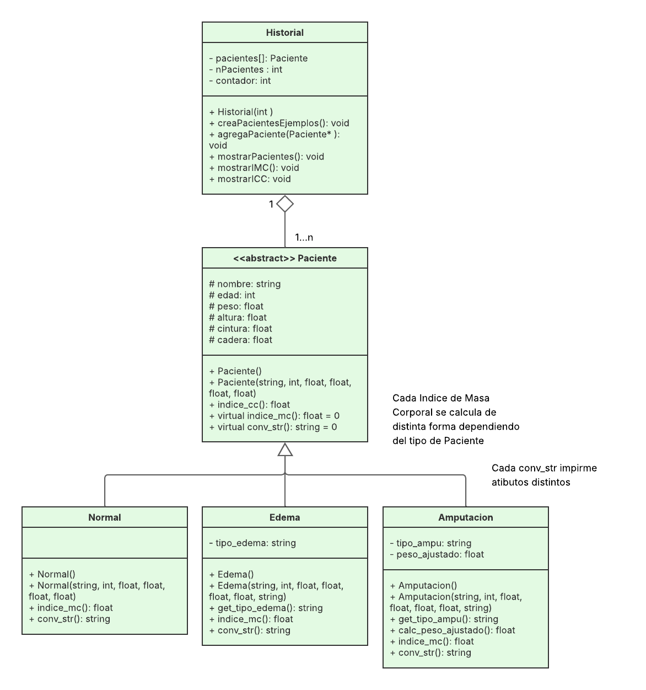

# TC1030-Programacion-Orientada-a-Objetos

El proyecto busca ser una plataforma que ayude a un profesional en nutrición a llevar un historial clínico de sus pacientes, dividiendolos en distintas especificaciones en base a condiciones clínicas específicas, como en el caso de presentar un edema o una amputación. Así los datos e interpretaciones de las mismas se clasificarán para tomar los valores reales para estas condiciones. Los pacientes sin ninguna condición cuentan con indices normales, mientras que los que cuentan con problemas específicos tienen otros índices dependiendo de su condición. 

## Función 
El programa permite agregar nuevos pacientes y color sus datos, así como calcular su ínice de masa corporal y su índice cintura cadera. Dando los datos para la interpretación del profesional de una forma más eficiente. 

Para generar un nuevo Paciente se indica en el menú, ingresas los datos requeridos y se almacena en tu historial clínico. Ejemplo de ejecución:

Nombre del Paciente:\
Victor\
Edad del Paciente:\
20\
Peso del Paciente (kg):\
72\
Altura del Paciente (m):\
1.78\
Cintura del paciente (cm):\
65\
Cadera del paciente (cm):\
70\
Tipo de Edema del paciente (Con mayúscula):\
Tobillo // Rodilla // Raiz Pierna // Anasarca\
Tobillo

Diagrama de Clases del Proyecto: 

## Consideraciones
El programa solo corre en la consola y esta hecho con c++ standard por lo que corre en todos los sistemas operativos

compilar con: "g++ Paciente.h Historial.h main.cpp"

correr en linux: "/a.out"

correr en windows: "a.exe"

Si no se colocan los valores específicos que se indican al momento de generar un paciente tipo Edema o Amputacion, marcará error o no se podrán utilizar correctamente los métodos de la clase. Colocar los valores inidicados exactamente (tipo de edema o tipo de emputación).

## Referencias extras para el proyecto
- std::fixed // std::setpreision() // Definir el número de decimales con los que se imprimirá el dato.\
cplusplus, fixed. https://cplusplus.com/reference/ios/fixed/

- std::cin.ignore // std::getline(std::cin, n) // Evitar errores cuando el usuario indica un string con espacios\
Abba, I., (2023). Getline en C++ - Ejemplo con función getline(). https://www.freecodecamp.org/espanol/news/getline-en-c-ejemplo-con-funcion-getline/

